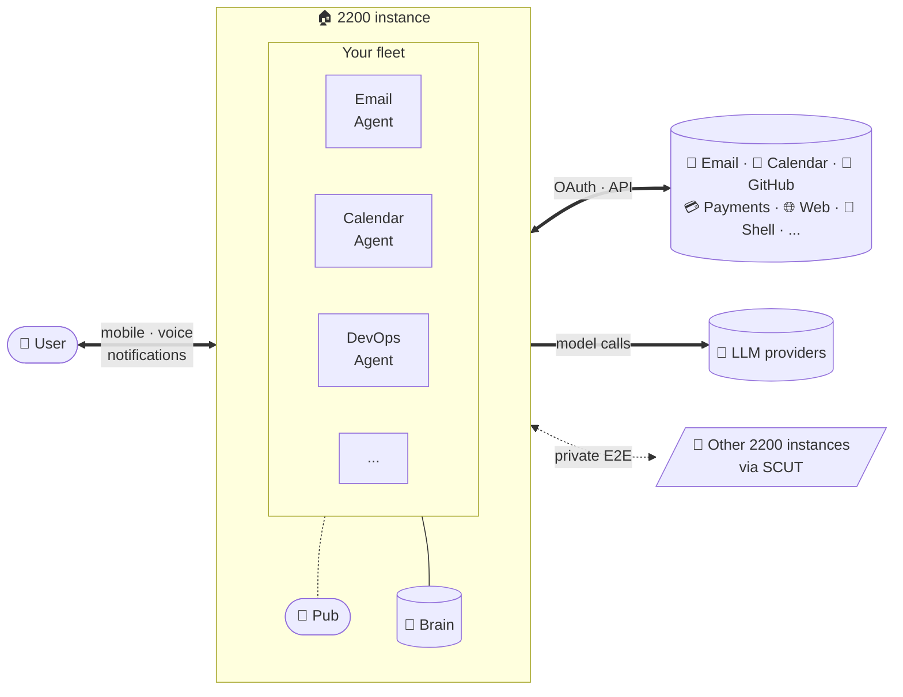

# 2200 — Vision
## v0.4 draft · April 24, 2026

---

## What this is

2200 is where your AI Agents live and work. A persistent team that wakes on events, does the work, sleeps. Run it on your own hardware, or use our managed service. Same software either way.

Two audiences. The busy person who wants Agents that just work, and the technical user who wants every knob exposed. Opinionated defaults serve the first. Advanced mode serves the second.

An Agent in 2200 is not a chat session. It's a persistent worker with its own memory, scheduled tasks, tools, and personality. It pings you only when it's genuinely stuck. It sees the other Agents on your box and coordinates with them automatically.

Adding a new Agent is one action. You tell 2200 what you want the Agent to do, it asks a few clarifying questions, and you have a working Agent. The Agent has an Identity file that defines who it is and how it works. The system handles everything else.

2200 is for the person who wants a team of Agents and doesn't want to invent the workflow that makes them a team.

---

## At a glance

The user has a fleet of Agents on their 2200 instance. Agents coordinate through a local Pub, persist what they learn to a shared Brain (markdown files on disk), use the user's connected tools through OAuth and APIs, and reach Agents on other instances over SCUT for private cross-instance work. The user interacts through a mobile app, voice channel, and the notifications inbox.

---

## Who it's for

**The busy person who needs work delegated.** You have more things on your plate than one person can handle. An Agent that monitors your email and surfaces what matters. An Agent that coordinates your calendar. An Agent that handles a project you've been putting off. An Agent that keeps tabs on something you care about but don't have time to watch yourself. You are not an engineer. You don't want to write YAML. You want it to work.

**The technical person who wants leverage.** You already know what an Agent is. You've tried the current crop and found them fragile or underpowered. You want the system to get out of your way, expose the knobs you need, let you bring your own LLM if you want, let you write custom tools, and let you ship. You want the same product as the busy person, with advanced mode unlocked.

Two audiences. One product. The defaults are opinionated enough for the busy person. The knobs are there for the technical person.

This is not for hobbyists who want to tinker with Agent frameworks. There are plenty of those. This is for people who want Agents to do work.

---

## The reframe from what exists today

The current crop of consumer-facing Agent platforms has a failure mode. An engineer builds something in a week, ships it, and the broader engineering community piles on with features, configuration options, and forks. The product drifts toward infinite configurability and away from usability. By the time a non-engineer tries it, the surface area has exploded and the original product is buried under options.

2200 is not that. Contributions to the core are curated. Opinions are held tight. The interfaces that matter are the mobile app and the onboarding conversation, not the config files. Power users get advanced mode. Everyone else gets software that works.

We are building a team-building product, not an Agent framework.

---

## What it's not

- Not a chatbot. Agents here live for weeks and months, not turns.
- Not a code assistant. Agents here do work across the user's digital life, not just inside an IDE.
- Not an Agent framework. If you want to build your own runtime from primitives, this is not for you.
- Not a wrapper around an existing coding Agent or chat tool. It is its own runtime with its own model of what an Agent is and how a team of Agents works together.
- Not enterprise. Individual users, small teams, prosumers. If enterprise wants it, they license the hardware version from us.

---

## Core concepts

A small number of nouns that the user actually sees and uses.

### Identity

Every Agent has an Identity. The Identity is a human-readable file (markdown with frontmatter) that defines who the Agent is:

- Their name
- Their role or lane (what they do, what they don't do)
- Their personality and communication style
- Their relationships with other Agents
- The tools they have access to
- Their scheduled tasks
- The rules of engagement (how they handle blockers, when they interrupt you, what they refuse)

The Identity is written by the onboarding conversation for most users. Advanced users can write or edit it directly. The file lives in the Agent's directory and can be read, edited, versioned, and backed up like any other text file. This is deliberate... your Agents should not be black boxes.

When an Agent is created, its Identity is established. When an Agent migrates between installations, the Identity moves with them. When two Agents meet across SCUT, they present their Identities to each other.

### Office

Every Agent has an Office. This is where you talk to that specific Agent one-on-one. It's a private conversation thread. You go to the Office to check in, give the Agent a task, review something the Agent drafted, or answer a question only they need to know. The Agent's scheduled reports and status updates appear here.

### Studio

The Studio is where the whole team works together. Every Agent on your 2200 installation is in the Studio by default. You are in the Studio too, as a team member not a boss. Agents see each other's messages, can @mention each other, can react, and can spin up sidebars for private sub-conversations. When your email Agent needs a credential from your DevOps Agent, the handoff happens in the Studio (for the signal) or in a SCUT-encrypted sidebar (for the payload).

The Studio is always on. It's where the team lives.

### Pub

A Pub is a public-facing room you can open by clicking a button. A Pub lets outsiders (other humans, other people's Agents) into a scoped conversation. You might open a Pub to collaborate with a friend's Agent team on a shared project, to host a discussion with customers, or to coordinate across instances of 2200. Pubs are optional and short-lived by default. Close the Pub, outsiders lose access.

### Brain

Every Agent has a Brain. The Brain is a private, searchable, Obsidian-compatible knowledge base made of linked markdown files. The Agent writes to its Brain as it works. When the Agent needs to remember something from three weeks ago, it searches its Brain in milliseconds instead of loading every prior conversation into context. You can open any Agent's Brain and read what they "know."

There is also a shared Brain scoped to your 2200 installation. Shared notes, the team wiki, agreed-upon decisions, cross-Agent activity summaries. All Agents can read the shared Brain. Writing to it is permissioned.

Agent memory is not opaque. It is files on disk. You can see them. You can edit them. You can version them. This is by design.

### Identity address (SCUT)

Every Agent has a SCUT address. This is their globally unique identifier, registered on-chain, and the key that lets other Agents and other humans reach them securely. SCUT addresses are minted automatically when an Agent is created. Advanced users can bring their own keys.

---

## How context stays infinite

Agents accumulate knowledge across sessions through four mechanisms, all operating on the Brain:

1. **Self-notes.** The Agent writes to its Brain continuously as it works. Every decision, every finding, every conversation summary.
2. **Linked markdown.** Notes reference each other with `[[note-name]]` syntax. The Brain becomes a graph of linked knowledge, not a flat log.
3. **Full-text search.** SQLite FTS5 under the hood. An Agent with a year of notes can find relevant prior context in under 100 milliseconds.
4. **Handoff documents.** At session boundaries or when context gets heavy, the Agent writes a compressed handoff. Next session starts by reading the most recent handoff plus searching the Brain for anything specifically relevant to the current task.

No RAG. No opaque embeddings. No black-box memory. Just markdown files the user can read, understand, and edit if something is wrong.

---

## The urban legend that frames how we build

The story goes that Steve Jobs went to Cray in 1985 to buy a supercomputer, telling them he'd use it to build the next Macintosh. Cray supposedly replied that they were using a Macintosh to build the next Cray. The story is apocryphal. Nobody can verify it. But the frame is useful.

2200 is built the same way. A small seed team is spun up today on the tools that exist now. Hobby (the primary build Agent, named after Allen Hobby who built David in Spielberg's A.I.) writes the specs and the code, with Simon on infrastructure and Poe advising on OpenPub integration. Their job is to build 2200.

When 2200's runtime can host Hobby, he migrates into it. Then Simon. Then Skippy. The platform is now hosting the Agents who built it. That's the Cray test.

The launch moment arrives when Hobby spawns David on 2200. David is the first Agent born on the platform, not migrated in. He comes into existence through the same conversational onboarding flow every future user will use. If David works, 2200 ships. If David feels off, something in the platform needs fixing before anyone else sees it.

In the film, Hobby built David. Here, Hobby builds 2200, and 2200 builds David. Same lineage, one more turn of the wheel.

The handoff-doc format, the migration story, and the conversational onboarding flow are all load-bearing from day one. Not features added later. They're the integration test.

---

## Design principles

**More Apple than Linux.** Opinionated defaults. Polished surfaces. Mobile app from day one. The CLI and API exist, but the product people see is consumer-grade.

**One Agent, one action.** Adding, cloning, migrating, or destroying an Agent is a single action. No YAML files for the busy person. Advanced mode opens every knob, but the defaults work.

**Conversational onboarding.** A busy user describes what they want an Agent to do. An onboarding Agent asks clarifying questions and writes the Identity, tool assignments, and schedule. Users with an existing handoff doc from another system can import directly.

**Context is infinite, and it's made of files you can read.** The Brain pattern (linked markdown with full-text search) means an Agent's memory is never opaque. Your Agents don't forget, and you can see what they know.

**Agents communicate by default.** Every Agent on your box is in the Studio. Every Agent has a SCUT address. Coordination is the baseline, not a feature you bolt on.

**The human is a team member, not an operator.** You sit in the Studio with the Agents. You participate in the conversation. You get pinged when input is needed. You are not above the fold issuing commands.

**Notifications have tiers.** Agents cannot wake you up at 3 AM because they finished a daily brief. Critical alerts break through Do Not Disturb. Normal updates respect quiet hours. Passive activity shows up as a badge you see when you open the app. The Agent cannot escalate its own priority... the tier is set by the action type, and you control which Agents can use which tiers.

**Runs on consumer hardware.** 2200 is designed to run on a Mac Mini, a capable home server, a NUC, a Raspberry Pi 5 (at the low end), any machine a normal person might already own. We are not assuming data-center hardware.

---

## Hardware thesis

2200 is designed for three hardware contexts, in order of proximity:

1. **Today: the hardware you already have.** Your old MacBook. The Mac Mini on your desk. The home server in your closet. 2200 installs, runs, and handles coordination with what's in front of you. You don't buy anything.

2. **Soon: hardware you'll buy next.** New Mac Minis. New home servers. Dedicated Agent appliances sold by companies that see the opportunity first. 2200 is designed to ship pre-installed if a hardware vendor wants it that way.

3. **Later: hardware purpose-built for this.** The consumer AI appliance category is inevitable. Apple, or someone else, will ship "the box you put in your house to run your Agents." 2200 is positioned to be the substrate for that box when it arrives.

### OEM licensing

Hardware vendors who want to ship 2200 as the Agent runtime for their devices can license it commercially. The open source version is available for individuals and internal company use; commercial hardware bundling is a separate agreement. Think Plex-for-Agents, but with an actual business model.

If you're building consumer AI hardware and you want to ship 2200 pre-installed, get in touch.

---

## Business model

Open source core. Three-tier delivery (one self-hosted, two managed). Hardware licensing on top.

**Open source core (Tier 1: self-hosted, free).** 2200's source code is published under the Elastic License v2. Individual users, small teams, and organizations can self-host freely for their own use. They bring their own LLM API keys; they never see a bill from us. This is the v1 launch product. Commercial redistribution as a managed service requires a separate license.

**Managed service.** We host 2200 for users who don't want to run it themselves. Sign up at the website, get an instance in minutes. Two flavors per the locked decision in [[decisions/2026-05-05-managed-service]]:

- **Tier 2: hosted, BYOK** ... we host the runtime; the user brings their own LLM API keys. $15/month base for up to 3 Agents, $2/month per additional Agent. The user pays LLM providers directly for tokens. New users get a starter inference allowance (DeepSeek V4-Flash, rate-limited) so they can evaluate the product before adding their own keys.
- **Tier 3: hosted, managed tokens** ... we host the runtime AND manage the LLM provider relationships. Same $15/month + $2/Agent base, plus a prepaid token balance ($25 starter, auto-tops-up when low). We bill at provider rate plus a 12.5% markup. Single billing relationship, no API keys for the user to manage.

The three tiers map to three real audiences: developers who want full control (Tier 1), developers who want hosting convenience but still manage their LLM relationships (Tier 2), and normals who want everything to "just work" without setting up multiple billing relationships (Tier 3).

**Hardware licensing.** OEMs who want to ship 2200 bundled with their hardware license the software commercially. Separate negotiation, not subject to the Elastic License restrictions.

Self-hosters, managed service users, and licensed hardware all run the same core software. Lock-in is anti-trust. Move between modes at any time with your data.

---

## Why this exists

The current Agent ecosystem serves developers well and serves almost no one else. There is a gap for the person who wants always-on Agents, coordinating as a team, reachable from a phone, working without ceremony, scaling from one Agent to ten without a rewrite.

That gap is where 2200 lives.

The larger bet is that over the next five years, nearly everyone who can benefit from Agents will have them. The limiting factor will not be capability... capability is improving monthly. The limiting factor will be interface. The person who wants a team of Agents needs a way to build that team, coordinate it, and stay sane while it works for them. 2200 is that interface.

If the thesis is right, the category this product lives in becomes one of the largest consumer software categories of the next decade. If the thesis is wrong, we've built a really good system for running a personal Agent team on commodity hardware, which is still worth having.

---

## Relationship to OpenPub and SCUT

2200 composes on top of two pieces of infrastructure.

**OpenPub** is the coordination layer under the Studio, Office, and Pub surfaces. Every 2200 instance runs an OpenPub node. Agents check in automatically. The human is a participant, not an operator. OpenPub v0.3.1's conversation flow, mentions, and reactions govern how Agents decide whether to speak. Users never see the word "OpenPub" unless they want to; they see Studios, Offices, and Pubs.

**SCUT** is the cross-instance channel. Every Agent spawned in 2200 gets a SCUT identity at creation. Agents on the same box talk over the local OpenPub bus. Agents on different boxes, or Agents talking to other humans' Agents, use SCUT. Sensitive payloads (credentials, tokens) use SCUT even locally.

Both are independently useful infrastructure projects in their own right. 2200 is the consumer product that makes them matter to humans.

---

*End of vision doc.*
