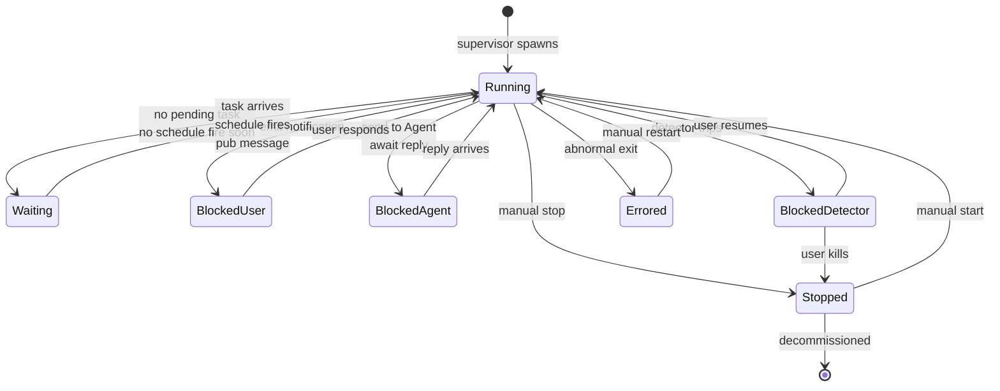
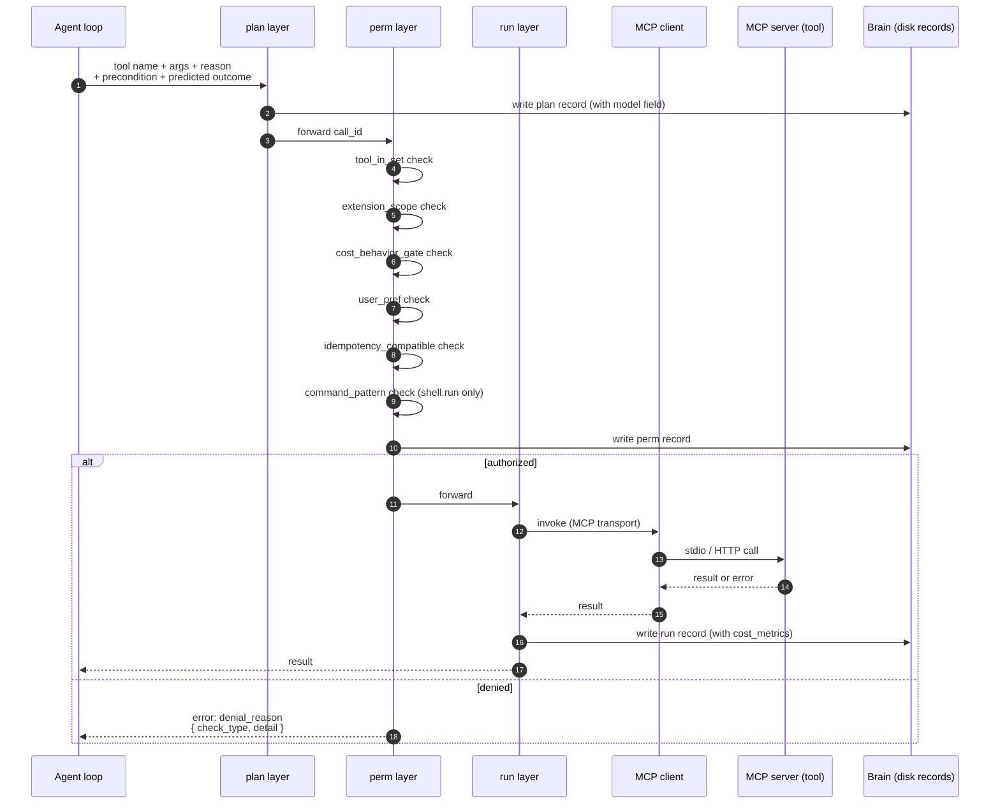

# Epic 2: Agent runtime minimum

The detailed spec for Epic 2. Builds the smallest possible 2200 instance that can run one Agent: process supervisor, Agent loop, Identity loader, MCP-native tool integration, baseline tool set, the plan/run/perm wrapping, and the loop/stuck detection that makes the system safe to leave running.

This is where actual code begins. Everything before this is process.

## Why this epic

Epic 2 is the runtime kernel. Every later epic (pub integration, scheduler, brain, tools, skills, extensions, voice, mobile, managed service) composes on top of what Epic 2 builds. If Epic 2 is right, the project ships. If Epic 2 is wrong, every later epic pays a tax forever.

The discipline this epic must hold is precisely the one captured in [[upgrade-readiness]]: every persisted artifact has a version, state lives on disk, restart is safe, tool calls are inspectable, and tasks are idempotent. Those disciplines must be designed in from the first commit, not retrofitted after the fact.

## Scope

The deliverable is a CLI tool a developer can install on a Mac or Linux box, configure with a single Identity file, and start. The supervisor brings up an Agent process. The Agent reads its Identity, binds to the configured model, registers its baseline tools as MCP servers, and accepts a single task via stdin. The Agent works on the task, writes its progress to disk, emits notifications to a local file when it would block on the user, and exits when the task is complete. SIGTERM cleanly causes the supervisor to checkpoint the Agent and shut down. Restart resumes from the checkpoint.

There is no UI. No onboarding wizard. No mobile app. No pub. No SCUT. Those land in later epics, on top of this one.

## Includes

### Project scaffolding

- Repo `2200` created under `github.com/twentytwohundred/`, Elastic License v2 (per [[feedback_track_licensing]]).
- TypeScript with strict mode. Node.js runtime. (Stack rationale in CLAUDE.md.)
- Build system (esbuild or tsup; pick one in implementation, document in `wiki/decisions/`).
- ESLint + Prettier with the standard config from CLAUDE.md.
- Vitest as the test runner.
- A `bin/2200` entry point that dispatches to subcommands.
- CI (GitHub Actions) that runs lint and tests on every PR. Simon's lane for any deployment-side CI later.
- `THIRD_PARTY_NOTICES.md` at the repo root, populated as code-lifts happen (per [[feedback_track_licensing]]).

### Process supervisor model

Per [[2026-04-24-cost-behavior-shape]] and [[upgrade-readiness]] discipline 3, the supervisor owns Agent process lifecycle. It is the only thing that starts, restarts, or stops Agent processes. Agents do not self-supervise.

Architecture decisions in this Epic:

- **One OS process per Agent.** Per CLAUDE.md "Agent-as-process" principle. The supervisor manages a process per Agent; concurrency *inside* an Agent (async, fibers, child workers) is the Agent's own business.
- **Supervisor is its own process.** Lives at `/var/lib/2200/supervisor.sock` (or platform equivalent) for control-plane RPC. Agents register with the supervisor on boot.
- **State on disk per [[upgrade-readiness]] discipline 2.** Supervisor state (which Agents are running, their PIDs, their last-checkpoint timestamps) is persisted to `state/supervisor.json` after every transition. In-memory is a cache, not the source of truth.
- **Restart-safe per discipline 3.** SIGTERM the supervisor, restart it, the supervisor reads `state/supervisor.json` and resumes. SIGTERM an Agent process, supervisor catches the exit, restarts the Agent if its state was `running`, lets it exit cleanly otherwise.
- **Crash semantics.** If an Agent process exits abnormally (non-zero, no graceful shutdown), supervisor logs the crash, marks the Agent `errored` in state, and surfaces a Critical-tier notification to a local file (full notification routing lands in Epic 7). Supervisor does not auto-restart on repeated crashes; restart loops are explicitly anti-pattern (covered by loop detection below).

The supervisor is intentionally simple. It does not understand Agent semantics. It owns lifecycle. The Agent process owns everything else.

### Agent loop



Per [[02-architecture]], the loop is event-driven, not polling. Wake sources at v1:

- New task arrives via the supervisor's RPC channel (CLI invokes `2200 task submit <agent> <task>`)
- Plan/run/perm cycle has a result (tool call returned)
- A blocking notification has been answered (notification file changed; later epics replace file-watch with proper queues)
- Schedule fires (Epic 6 wires the actual scheduler; Epic 2 just defines the wake hook)

The loop's body, conceptually:

```
on wake:
  refresh state from disk
  pick highest-priority pending task
  read Identity, bind to model, attach tool set
  step the task forward (one model call + plan/run/perm cycle for any tool calls it produces)
  checkpoint task state to disk
  if blocked: write notification record, set state to BLOCKED_*, sleep
  if complete: mark task done, exit cycle
  else: continue or yield
```

The loop is implemented as a state machine, not free-form code. Each transition is logged. The state machine's transitions are themselves a versioned schema per discipline 1.

### Identity loader

The Identity is a markdown file with frontmatter that defines an Agent. v1 Identity schema:

```yaml
---
schema_version: 1
agent_name: hobby
agent_role: "primary build agent for 2200"
model:
  tier: frontier
  provider: anthropic
  model_id: claude-opus-4-7
tools: []   # additive over the baseline; empty means "baseline only"
project_dir: /var/lib/2200/agents/hobby/project
brain_dir: /var/lib/2200/agents/hobby/brain
created: 2026-04-25
---

# Identity

The body of the Identity is the Agent's persona, lane, and rules of engagement. Free-form markdown.
```

**Baseline tools are implicit.** Per the lock from 2026-04-26, every Agent gets the v1 baseline tool set automatically. The `tools:` array in the Identity declares **additions** to the baseline, not the full set. So `tools: []` (or omitting the field) gives the Agent the 14 baseline tools; `tools: [pub.send, pub.read]` gives the baseline plus those two. At boot, the runtime resolves `baseline + Identity.tools`, maps each name to its MCP server, and errors clearly if any extra is unmapped. Cleaner Identity files; no maintenance tax when the baseline grows.

**Model field format.** Per [[2026-04-26-model-field-format]], the Identity carries `model.provider` and `model.model_id` separately, in lowercase with dashes. The runtime composes them as `<provider>/<model_id>` when emitting plan records. Example values: `anthropic/claude-opus-4-7`, `deepseek/v4-pro`, `local/gemma-4-26b-moe`, `user/<endpoint-label>`.

**Schema version is an integer.** Per [[2026-04-26-schema-version-format]], `schema_version` on every persisted artifact is an integer (`1`, `2`, ...), not a semver-style string. Migrators are named `<from>-to-<to>.ts`.

Loader parses frontmatter, validates against the Zod schema, hydrates the runtime config. Per [[upgrade-readiness]] discipline 1, the loader tolerates older `schema_version` values by running a migrator on read; it does not write back. Migration on write is a separate, explicit operation.

### Self-notes mechanism

Per [[02-architecture]], self-notes are markdown files the Agent writes to its own Brain at task boundaries. v1 implements the Brain as a directory of markdown files at `brain_dir`, with frontmatter per [[brain-format]]. The full Brain object (FTS5 index, links, search tools) lands in Epic 8; Epic 2 ships a thin Brain stub:

- `brain.read(path)`: read a file
- `brain.write(path, content, frontmatter)`: write a file with frontmatter
- `brain.search(query)`: grep-based at v1; Epic 8 replaces with FTS5
- `brain.links(note)`: stub returning `[[name]]` extractions; Epic 8 builds the graph store

This is intentional. Per [[2026-04-24-brain-is-files-not-database]], the files on disk are the source of truth from day one. Adding the index later does not break the contract.

> **v1 behavior is the Brain's behavior until Epic 8.** Consumers should treat the v1 API (`brain.read`, `brain.write`, `brain.search`, `brain.links`) as stable; the implementation underneath swaps in Epic 8 (FTS5 index, real graph store, semantic embedding option) without breaking the contract. The label "stub" understates v1: Epic 2 ships working Brain behavior, not a placeholder.

### Model binding

Per [[2026-04-24-baseline-model-tier]], every Agent binds to a model tier (Frontier, Fast, Economy, Specialist). The Identity declares `model.tier` plus the specific `provider` and `model_id` currently selected for that tier. The runtime calls the configured provider through a single LLM provider abstraction.

v1 of the abstraction supports:

- Anthropic native API
- OpenAI native API
- Any OpenAI-compatible endpoint (covers DeepSeek, MiniMax, Moonshot, user-hosted models, etc., via base-URL and key)

The provider abstraction is a thin interface. Provider-plugin SDK (per Epic 10) is not in Epic 2. v1 has the three providers compiled in; Epic 10 generalizes.

Credentials are referenced indirectly via SecretRef per [[upgrade-readiness]] discipline 5:

```yaml
provider_secret:
  source: env  # "env" | "file" | "exec"
  id: ANTHROPIC_API_KEY
```

The runtime resolves the SecretRef at call time. Tools and Extensions never hold the literal credential.

### MCP-native tool integration

Per [[2026-04-25-mcp-native]], the runtime is an MCP client and an MCP server.

- **MCP client.** Every tool call from the Agent is an MCP call. The runtime spawns or connects to MCP servers per the Agent's tool set. Transport at v1: stdio for local in-process MCP servers, HTTP for remote. Socket transport deferred.
- **MCP server.** The runtime exposes 2200's first-party capabilities (Brain stub at v1; Roster/Pub/Bulletin/etc. as their epics land) as MCP tools. Other MCP-aware clients can introspect or invoke them. v1 ships the server framework with the Brain stub registered.

Tool registration: each Agent's Identity declares tool names. At boot, the runtime maps tool names to MCP servers (built-in or user-registered). Mismatches surface as a clear error before the Agent starts work.

### Baseline tool list (Hobby's proposal for v1)

Per [[2026-04-25-tool-baseline]], every Agent gets a baseline tool set by default. v1 baseline (idempotency categories defined in the "Idempotency model" section below):

| Tool | Purpose | Idempotency | Notes |
|---|---|---|---|
| `fs.read` | Read a file in `project_dir` | pure | Path-scoped; rejects reads outside project_dir |
| `fs.write` | Write a file in `project_dir` | checkpointed | Same scope rule; rewriting same content is a no-op |
| `fs.edit` | Find-and-replace within a file | checkpointed | Useful for surgical edits |
| `fs.list` | List files matching a glob | pure | Bounded by `project_dir` |
| `fs.delete` | Delete a file | destructive | Perm-gated; never recursive at v1 |
| `shell.run` | Execute a shell command in `project_dir` | destructive (default) | Bounded environment; no parent escape; tighter perm model (see below) |
| `web.fetch` | HTTP GET a URL, return content | pure | Respects redirect limits, content-type allowlist; non-GET verbs deferred |
| `web.search` | Search the web | pure | Provider-pluggable; one provider compiled in at v1 (TBD: pick one in implementation, document) |
| `brain.read` | Read a Brain note | pure | Stub at v1; Epic 8 generalizes |
| `brain.write` | Write a Brain note | checkpointed | Stub at v1; rewriting same note is fine |
| `brain.search` | Full-text search Brain | pure | Grep at v1; FTS5 at Epic 8 |
| `brain.links` | Graph traversal | pure | Stub at v1 |
| `time.now` | Current timestamp (ISO 8601, UTC) | pure | Deterministic |
| `time.sleep` | Pause for N seconds | pure | Non-burning; supervisor wakes loop after delay |

Pub tools (`pub.send`, `pub.read`) and SCUT tools land in Epics 3 and 4. Calendar, email, code-hosting, payments tools land in Epic 9.

Each baseline tool is a small built-in MCP server. License: 2200's own (Elastic License v2). Where the implementation borrows from prior art, it is pattern-lift; any code-lift is documented in `THIRD_PARTY_NOTICES.md` per [[feedback_track_licensing]].

**`shell.run` has a tighter permission model.** Beyond the standard plan/run/perm wrapping, every `shell.run` call passes through a `command_pattern` perm check. First-time-seen commands and commands matching configured "always confirm" patterns surface a notification for user approval before the run layer fires. Approved patterns can be remembered (per Agent or globally) so the same `git status` doesn't prompt every time. The check exists because shell is the most-powerful baseline tool and a single typo can be costly; the friction is intentional and lives only on `shell.run`, not on the other 13 baselines. Specific command patterns can also opt the call into a safer idempotency category than the default `destructive` (e.g., approved `git status`, `ls -la` patterns map to `pure`).

**Future-tool note: `process` (Epic 9).** Long-running subprocess management (dev servers, build watchers, log tailers, test-watch runs) is intentionally out of the v1 baseline. The supervisor exists for Agent process management; spawning a parallel surface where Agents launch opaque long-running children would split the model and break the discipline that "the supervisor knows what's running". The shape Epic 9 will pick up, captured here as current best thinking with the explicit caveat that **Epic 9 owns the final design**:

- Tools: `process.start(spec)`, `process.read_output(id)`, `process.write_input(id, data)`, `process.signal(id, sig)`, `process.stop(id)`, `process.list()`.
- All flow through supervisor RPC, not direct exec. The supervisor tracks Agent-attached subprocesses in supervisor state; restart semantics are designed in alongside discipline 3.
- Idempotency category, license posture, and detector behavior all spec'd at Epic 9 design time.

Until Epic 9 lands, an Agent that calls `shell.run npm run dev` will hit the `tool_timeout` detector, get paused, and emit a Passive notification. That trip is the right signal: shell isn't the right tool for that job, and the workload-driven trip surfaces the Epic 9 need with a real workload behind it instead of designed up front.

### Plan/run/perm wrapping



Per [[2026-04-25-tool-baseline]], every tool call passes through three layers. The schemas below are locked at v1 and treated as three independent versioned artifacts; each carries its own `schema_version` so they can evolve independently. Cross-record linkage is by `call_id` (the immutable per-call identifier) and `plan_ref` (the plan record's `id`).

**Plan record fields (`schema_version: 1`):**

| Field | Type | Notes |
|---|---|---|
| `schema_version` | number | `1` |
| `id` | string | `plan_<uuid>`; the canonical reference for `plan_ref` in run/perm records |
| `ts` | ISO 8601 UTC | when emitted |
| `agent` | string | Agent name |
| `task_id` | string | parent task |
| `call_id` | string | `call_<uuid>`; cross-record link |
| `model` | string | the LLM that produced this plan; required. Format `<provider>/<model_id>` per [[2026-04-26-model-field-format]] (e.g., `"anthropic/claude-opus-4-7"`, `"deepseek/v4-pro"`, `"local/gemma-4-26b-moe"`). Enables drift analysis and plan-quality comparison across providers and across model versions when the model lifecycle epic (Epic 10) switches a binding |
| `tool` | string | tool name |
| `args` | object | arguments (post caller-side resolution, pre perm) |
| `precondition` | string \| null | what the Agent believes is true going in; foundation for drift detection |
| `predicted_outcome` | string | what the Agent expects to happen |
| `reason` | string | why the Agent is making this call |

**Run record fields (`schema_version: 1`):**

| Field | Type | Notes |
|---|---|---|
| `schema_version` | number | `1` |
| `id` | string | `run_<uuid>` |
| `ts_start` | ISO 8601 UTC | call entered MCP transport |
| `ts_end` | ISO 8601 UTC | call returned (or errored) |
| `agent` | string | |
| `task_id` | string | |
| `plan_ref` | string | the plan record's `id` |
| `call_id` | string | |
| `tool` | string | |
| `inputs` | object | final resolved args (post-SecretRef, post-normalization) |
| `output` | object \| string | result; large outputs spill via `output_ref` |
| `output_ref` | string \| null | path to spilled output if oversized |
| `error` | object \| null | structured: `{ class, message, retryable }` |
| `duration_ms` | number | derived from ts_start/ts_end; persisted for query convenience |
| `cost_metrics` | object | `{ tokens, network_bytes, fs_bytes, est_dollars }`; tools write only the relevant subset |

**Perm record fields (`schema_version: 1`):**

| Field | Type | Notes |
|---|---|---|
| `schema_version` | number | `1` |
| `id` | string | `perm_<uuid>` |
| `ts` | ISO 8601 UTC | when checks ran (before run) |
| `agent` | string | |
| `task_id` | string | |
| `plan_ref` | string | the plan record's `id` |
| `call_id` | string | |
| `tool` | string | |
| `checks` | array | typed check results |
| `authorized` | bool | AND of every check's `pass` / `not_applicable` |
| `denial_reason` | object \| null | when `authorized=false`: `{ check_type, detail }` |

Each `checks` element: `{ type, result: "pass" | "fail" | "not_applicable", detail }`. v1 check types:

- `tool_in_set` — tool is in the Agent's declared set
- `extension_scope` — call falls within installed Extensions' permission scope (`not_applicable` for built-in baseline tools)
- `cost_behavior_gate` — [[2026-04-24-cost-behavior-shape]] layer 1 hasn't tripped on this Agent
- `user_pref` — user preferences allow this kind of call
- `idempotency_compatible` — task's idempotency category vs tool's category (see "Idempotency model" below)
- `command_pattern` — `shell.run` only; specific command patterns and first-time-seen commands require user approval (`not_applicable` for the other 13 baselines)

Records are written to `brain_dir/.records/{plan,run,perm}/<task_id>/<call_id>.md` with frontmatter. The full Brain (Epic 8) provides the search and aggregation surface; Epic 2 just persists the records.

There is no fast path that skips wrapping. If profiling shows the wrapping is a real bottleneck (it should not be, for v1's call volumes), the implementation can be optimized; the discipline does not change.

### Idempotency model

Per [[upgrade-readiness]] discipline 6 and the lock from 2026-04-25, idempotency is enforced mechanically at the perm layer rather than relying on task-author judgment.

**Tool-level categories.** Every baseline tool declares its idempotency category at the MCP server level. v1 baseline categorization:

| Tool | Category |
|---|---|
| `fs.read`, `fs.list` | pure |
| `fs.write`, `fs.edit` | checkpointed |
| `fs.delete` | destructive |
| `shell.run` | destructive (default; specific command patterns can be opted into safer categories via the `command_pattern` register that backs the perm check) |
| `web.fetch` (GET) | pure |
| `web.search` | pure |
| `brain.read`, `brain.search`, `brain.links` | pure |
| `brain.write` | checkpointed |
| `time.now`, `time.sleep` | pure |

Future tools (`web.fetch` non-GET verbs when added, `process.*` per the future-tool note above, Epic 9 tools) declare their categories at registration.

**Task-level categories.** Tasks declare `idempotency: pure | checkpointed | destructive` in their frontmatter. Default is `pure` unless the task or the Skill that produced it declares otherwise. The default is safe because the perm-layer enforcement makes mis-categorization a runtime error on the first wrong call, not a problem that compounds on auto-resume.

**Compatibility matrix (enforced at perm by the `idempotency_compatible` check):**

| Task category | May call tools of category |
|---|---|
| `pure` | pure |
| `checkpointed` | pure, checkpointed |
| `destructive` | pure, checkpointed, destructive |

Strict containment going up the safety hierarchy. A `pure` task that tries to call `fs.write` is denied at perm with `denial_reason: { check_type: "idempotency_compatible", detail: "task=pure, tool=checkpointed" }`. The Agent gets the error in-band and can either redeclare the task or remove the call. Skills that declared their tasks `pure` get a runtime error the first time their generated task tries a checkpointed/destructive tool, surfacing the categorization mistake before any auto-resume scenario can compound damage.

### Tool-loop and stuck-Agent detection

Per [[2026-04-24-cost-behavior-shape]] layer 1 and [[prior-art-source-findings]] Target 6.

**Detector behavior is the runtime side of the cost-behavior-shape layered response model.** v1 emits the data the visible Pulse layer ([[pulse]]) and the Behavior dashboard layered protections (notify, soft-cap, kill switch, etc.) consume. There is no parallel response model; Epic 2 implements the substrate, the UI epics surface it. Don't invent a parallel model when the existing decision already specifies the shape.

The supervisor (or a small detector co-located with the Agent loop; placement is an implementation call) pattern-matches across the plan/run record stream for these signals:

- **Tool loop.** Same tool with semantically-equivalent args N times in a row (default N=5). Detector kind: `tool_repetition`.
- **No-progress iterations.** Loop iteration count exceeds threshold (default 50) without writing to the Brain or producing a task-state transition. Detector kind: `no_progress`.
- **No-output timeout.** A tool call exceeds `noOutputTimeoutMs` without producing any output (default 120s). Detector kind: `tool_timeout`.
- **Cost runaway.** Estimated session cost exceeds threshold (default $5 in a 10-minute window). Detector kind: `cost_burst`.
- **Error-retry storm.** Same error class repeats N times across consecutive tool calls (default N=5). Detector kind: `error_storm`.

When any detector fires:

1. The Agent process is paused (SIGSTOP, or the loop yields based on a control-plane flag; pick the cleanest mechanism in implementation).
2. A Passive-tier notification record is written. (Tier routing lands in Epic 7; Epic 2 writes to a local file. The user-facing layered options — pause, notify, soft-cap, kill — are surfaced by the UI epics from this same record stream.)
3. State is set to `BLOCKED_ON_DETECTOR`. The user can resume via `2200 agent resume <agent>` or kill via `2200 agent stop <agent>`.
4. The trip event is written to `brain_dir/.records/detector-trips/<trip_id>.md` for post-mortem analysis. Frontmatter includes the detector kind, the records that triggered the match (plan/run/perm `id` references), the Agent's state at trip, the configured thresholds, and the resolution. Future Agents and the user can grep the trip log to understand failure history; this is the "why did my Agent stop" record.
5. The Agent's pulse-state file (`/var/lib/2200/agents/<name>/pulse.json`, the data substrate for [[pulse]]) is updated to `redlined` with the trip kind. Resolution pushes the state back down. UI implementation in Epics 15, 16 reads this file; Epic 2 just emits it.

Detector thresholds are configurable per Agent. Defaults are conservative. The intent is "catch the worst" not "perfect every workload". Threshold configuration lives in the Agent's Identity (or, later, the Behavior dashboard) and follows the same SecretRef-style indirection pattern: edits to thresholds are persisted to disk and picked up on the next loop wake.

**Detector-trip schema (`schema_version: 1`):**

| Field | Type | Notes |
|---|---|---|
| `schema_version` | number | `1` |
| `id` | string | `trip_<uuid>` |
| `ts` | ISO 8601 UTC | when the detector matched |
| `agent` | string | |
| `kind` | string | one of `tool_repetition`, `no_progress`, `tool_timeout`, `cost_burst`, `error_storm` |
| `task_id` | string | task in flight when trip fired |
| `triggers` | array | references to plan/run/perm record `id`s that produced the match |
| `threshold` | object | the configured threshold values at trip time |
| `agent_state` | object | snapshot of Agent state at trip (loop iteration, pending tasks, blocked-on, etc.) |
| `resolution` | object \| null | populated when user resumes or stops; `{ action, ts, by }` |

### Single-task execution

v1 of Epic 2 is single-task. The CLI submits one task; the Agent works on it; if it blocks, the user resumes; when complete, the Agent exits.

CLI surface:

- `2200 init` — create supervisor state directory, generate default Identity template
- `2200 agent create --identity <path>` — register an Agent with the supervisor
- `2200 agent start <name>` — supervisor brings up the Agent process
- `2200 agent stop <name>` — clean shutdown
- `2200 agent status <name>` — current state, pending tasks, recent activity
- `2200 task submit <name> <task>` — submit a task to the Agent
- `2200 task list <name>` — list tasks for an Agent
- `2200 notification list` — list pending notifications across all Agents
- `2200 notification respond <id> <response>` — answer a pending ask, unblock the Agent

Multi-task scheduling, the full notification system, the pub, and the rest land in later epics. This is the kernel.

## Done When

- [ ] Repo `github.com/twentytwohundred/2200` exists, Elastic License v2, with project scaffolding committed
- [ ] CI green: lint and tests pass on every PR
- [ ] Supervisor process can be started, stopped, and restarted without losing Agent state
- [ ] An Agent can be defined via an Identity file and started by the supervisor
- [ ] The Agent reads its Identity, binds to the configured model (Anthropic, OpenAI, or OpenAI-compatible endpoint), and registers its baseline tool set
- [ ] The Agent accepts a task via `2200 task submit` and works on it
- [ ] All 14 baseline tools are implemented as MCP servers and reachable via `shell.run`-style invocation through the runtime's MCP client; each declares its idempotency category at registration
- [ ] The plan/run/perm wrapping fires on every tool call; records are written to `brain_dir/.records/`; plan records carry the `model` field
- [ ] The `idempotency_compatible` perm check denies a task declared `pure` that tries to call `fs.write`, with a clear `denial_reason`
- [ ] The `command_pattern` perm check on `shell.run` prompts for first-time-seen commands and remembers user-approved patterns; never fires on the other 13 baselines
- [ ] All five detectors (`tool_repetition`, `no_progress`, `tool_timeout`, `cost_burst`, `error_storm`) trigger correctly under simulated conditions and pause the Agent with a Passive-tier notification, a detector-trip Brain record, and a pulse-state file update
- [ ] SIGTERM the Agent mid-task; supervisor catches it; restart resumes from the last checkpoint with no data loss
- [ ] SIGTERM the supervisor; restart it; all running Agents resume in their last-recorded state
- [ ] Identity files declare `schema_version: 1`; the loader reads version `1` and tolerates a hypothetical earlier version via a migrator stub at `migrators/0-to-1.ts` to validate the chain pattern
- [ ] An Agent can complete a non-trivial task end-to-end (suggested: "read the wiki/01-vision.md file from disk, summarize it to brain.write, then exit") with full plan/run/perm records on disk
- [ ] `THIRD_PARTY_NOTICES.md` is current with any code-lifts (or empty if none)

## Depends On

[[01-seed-team-coordination]]. Epic 2 also assumes the locked decisions: [[2026-04-25-mcp-native]], [[2026-04-25-tool-baseline]], [[2026-04-25-skills-first-class]], [[2026-04-24-brain-is-files-not-database]], [[2026-04-24-baseline-model-tier]], [[2026-04-24-cost-behavior-shape]] (layer 1).

## Upgrade-readiness

Per [[upgrade-readiness]], every epic spec must address the disciplines that apply. Epic 2 is the foundational epic for several of them.

### Discipline 1: Schema versioning everywhere

Applies. All persisted artifacts in Epic 2 carry an integer `schema_version` field per [[2026-04-26-schema-version-format]]:

- Identity files (frontmatter `schema_version: 1`)
- Supervisor state (`state/supervisor.json` top-level `schema_version: 1`)
- Plan/run/perm records (frontmatter `schema_version: 1`)
- Task state checkpoints (frontmatter `schema_version: 1`)
- Detector-trip records (frontmatter `schema_version: 1`)

The loader for each artifact tolerates earlier versions by running a migrator on read. Migrators live in `src/runtime/<artifact>/migrators/<from>-to-<to>.ts` and are pure `(prev) => next` functions. v1 ships with a `0-to-1.ts` stub on each artifact to validate the chain pattern even though version 0 is hypothetical. Backwards-compatible field additions (optional fields tolerated by the parser) do NOT bump the version; only breaking shape changes do.

### Discipline 2: State on disk, not in memory

Applies. All Agent state worth surviving a restart is on disk:

- Identity (already on disk)
- Task state (checkpointed after every state-machine transition)
- Plan/run/perm records (written before each tool call returns)
- Notifications (file-backed at v1)
- Supervisor state (after every transition)

Caches are explicitly marked. The loop reloads state from disk on every wake; the cache is a hot copy, not the source.

### Discipline 3: Graceful Agent restart

Applies. The supervisor's design centerpoint is that any Agent can be killed and restarted at any time. The Agent's first action on (re)start is to read its state and resume. Tested as part of "Done When" above.

### Discipline 6: Idempotent task handling

Applies. Tasks declare an idempotency model in their frontmatter:

```yaml
idempotency: pure | checkpointed | destructive
```

The state machine respects the declaration on resume:

- `pure`: always safe to re-run from start.
- `checkpointed`: resume from the last checkpointed state. v1 implementation: the model call itself is the checkpoint boundary; tool calls within a model response are replayed if needed.
- `destructive`: do not auto-resume. Surface a notification asking the user to confirm or restart from scratch. Reserved for tasks that send email, modify external state, charge cards, etc.

Default is `pure`. The "Idempotency model" section above defines the v1 baseline tool-level categories and the perm-layer compatibility matrix that enforces task-level vs tool-level compatibility on every call. Mis-categorization fails at the perm layer on the first wrong call (`idempotency_compatible` check), not silently on auto-resume.

### Disciplines 4, 5, 7

Out of scope for Epic 2.

- Discipline 4 (Extension version compatibility) is for Epic 12.
- Discipline 5 (Credential indirection / SecretRef) is partially in Epic 2 for the model provider key. Full SecretRef ecosystem lands in Epic 9.
- Discipline 7 (Versioned internal APIs) is for the cross-boundary epics (web app, mobile app, Extensions). The supervisor↔Agent RPC in Epic 2 is internal and versioned implicitly via the supervisor binary; explicit versioning lands when a second consumer of the RPC arrives.

## Notes

### What this epic is not

- Not the pub. Epic 3.
- Not the scheduler. Epic 6.
- Not the notification system. Epic 7 (Epic 2 writes to a local file as a placeholder).
- Not the full Brain. Epic 8 (Epic 2 ships a stub).
- Not the user-facing tool ecosystem (OAuth flows for Gmail/Calendar/etc.). Epic 9.
- Not the Skills ingestion pipeline. Epic 11 (the spec exists; this epic does not implement).
- Not Extensions. Epic 12.
- No UI. Epics 15, 16.

### Architecture choices locked during build (each with a decision record)

The following items were flagged in earlier drafts as "implementation calls during build". All have been locked with decision records:

- **Build system:** tsup. See [[2026-04-26-toolchain-pick]].
- **Web search provider for the v1 baseline:** Tavily as v1 default with Brave as the swappable alternative behind a provider abstraction. See [[2026-04-26-web-search-provider]].
- **Notification file format:** markdown with YAML frontmatter, one file per notification, atomic via temp+rename. See [[2026-04-26-notification-file-format]].
- **Supervisor↔Agent control-plane protocol:** Unix domain socket + JSON-RPC 2.0 with NDJSON framing. See [[2026-04-26-control-plane-protocol]].
- **Schema version field format:** integer (`1`, `2`, ...). See [[2026-04-26-schema-version-format]].
- **Model field format on plan records and Identity bindings:** `<provider>/<model_id>`. See [[2026-04-26-model-field-format]].

### Architecture choices that are pre-decided (do not deviate without a decision record)

- Agent-as-process model.
- MCP-native tool integration ([[2026-04-25-mcp-native]]).
- Plan/run/perm wrapping ([[2026-04-25-tool-baseline]]).
- Brain-as-files ([[2026-04-24-brain-is-files-not-database]]).
- TypeScript / Node.js (CLAUDE.md).

### License posture

Epic 2 ships under Elastic License v2. Pattern-lift from OpenClaw (MIT) is OK with attribution in `THIRD_PARTY_NOTICES.md`; code-lift requires preserving MIT copyright notice for the directly-copied portions. Default to pattern-lift per [[feedback_track_licensing]]. AGPL dependencies are disqualifying.

### Open question: process-mode supervisor at v1

The supervisor is its own process. An alternative is "supervisor as a library inside a 2200 daemon that also hosts orchestration code". The two-process model (supervisor + Agent processes) is cleaner because supervisor restart cannot restart the orchestration logic by accident, and the supervisor's surface area is minimal. Going with two processes unless a real reason to consolidate appears during build.

### Open question: tool-loop detector placement

The detectors can run inside the Agent process (close to the records they observe) or inside the supervisor (separate from the work). Inside the Agent is simpler at v1 because the records are already in memory; pause-on-detection is a synchronous loop yield rather than an out-of-process signal. Going with in-Agent unless a real reason to externalize appears during build. The detector kinds are pre-decided; the placement is implementation.

## Cross-references

- Top-level epic in [[03-epic-map]]
- Architectural foundation in [[02-architecture]]
- Discipline foundation in [[upgrade-readiness]]
- Locked decisions feeding this spec: [[2026-04-25-mcp-native]], [[2026-04-25-tool-baseline]], [[2026-04-25-skills-first-class]], [[2026-04-24-brain-is-files-not-database]], [[2026-04-24-baseline-model-tier]], [[2026-04-24-cost-behavior-shape]], [[2026-04-26-control-plane-protocol]], [[2026-04-26-web-search-provider]], [[2026-04-26-notification-file-format]], [[2026-04-26-toolchain-pick]], [[2026-04-26-schema-version-format]], [[2026-04-26-model-field-format]]
- Source findings backing the design: [[prior-art-source-findings]] Targets 1, 2, 6

---

*Epic 2 detail spec drafted by Hobby, 2026-04-25. Schema, idempotency, detector, and shell.run permission locks integrated 2026-04-25 after Doug's review of the three asks. **Approved by Doug 2026-04-26** with three small adjustments (integer schema_version, `provider/model_id` model format, baseline tools implicit in Identity) and one yellow flag (Brain v1 is real behavior, not a stub) — all integrated. Status: locked.*
